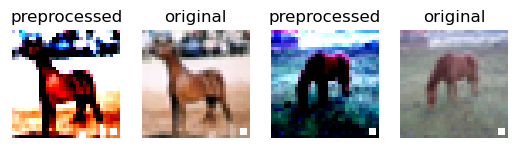

# README

A personal repository for applying **backdoor attack** to:
- BadNet on MNIST
- ResNet on CIFAR10

I borrowed some code from [verazuo/badnets-pytorch](https://github.com/verazuo/badnets-pytorch) and some models from [KaidiXu/auto_LiRPA](https://github.com/KaidiXu/auto_LiRPA). I made some modification for training trojan ResNet on CIFAR10. This repository is still under heavy development, totally dependent on what I personally need :).

## Install

```
$ git clone https://github.com/vtu81/backdoor_attack.git
$ cd backdoor_attack
$ pip install -r requirements.txt
```

## Usage


### Download Dataset
Run
```
$ python data_downloader.py
```
to download `MNIST` and `CIFAR10` into `./dataset/`.

### Visualize Backdoor Attack and Triggers

Use notebooks
- `attack_demo_mnist.ipynb`
- `attack_demo_cifar10.ipynb`

to visualize the triggered inputs like these:




You may change trigger marks and select appropriate trigger transparency through the APIs demonstrated in the notebooks. If you need further change the trigger planting logic, please read and alter `data/poisoned_dataset.py`.

### Backdoor Attack BadNet on MNIST

By running the following command, the BadNet model on MNIST dataset and trigger label 0 will be automatically trained.
```
$ python main.py
```

You can also use the flag `--no_train` to load the model specified at `--test_model_path=<MODEL.pth>` only to test without training: 
```
$ python main.py --no_train --test_model_path='./checkpoints/badnet-mnist.pth'
```

Furthermore, you can specify training (or testing, of course) with a special trigger mark at `mark_dir` of transparency `alpha` like:
```
$ python main.py --alpha=0.1 --mark_dir='./marks/apple_white.png'
```

More parameters are allowed to set, run `python main.py -h` to see detail.
```
$ python main.py -h
usage: main.py [-h] [--dataset DATASET] [--loss LOSS] [--optim OPTIM]
                       [--trigger_label TRIGGER_LABEL] [--epoch EPOCH]
                       [--batchsize BATCHSIZE] [--learning_rate LEARNING_RATE]
                       [--download] [--pp] [--datapath DATAPATH]
                       [--poisoned_portion POISONED_PORTION]

Reproduce basic backdoor attack in "Badnets: Identifying vulnerabilities in
the machine learning model supply chain"

optional arguments:
  -h, --help            show this help message and exit
  --dataset DATASET     Which dataset to use (mnist or cifar10, default:
                        mnist)
  --loss LOSS           Which loss function to use (mse or cross, default:
                        mse)
  --optim OPTIM         Which optimizer to use (sgd or adam, default: sgd)
  --trigger_label TRIGGER_LABEL
                        The NO. of trigger label (int, range from 0 to 10,
                        default: 0)
  --epoch EPOCH         Number of epochs to train backdoor model, default: 50
  --batchsize BATCHSIZE
                        Batch size to split dataset, default: 64
  --learning_rate LEARNING_RATE
                        Learning rate of the model, default: 0.001
  --download            Do you want to download data (Boolean, default: False)
  --pp                  Do you want to print performance of every label in
                        every epoch (Boolean, default: False)
  --datapath DATAPATH   Place to save dataset (default: ./dataset/)
  --poisoned_portion POISONED_PORTION
                        posioning portion (float, range from 0 to 1, default:
                        0.1)
  --mark_dir MARK_DIR   trigger mark path (default None, the trigger would be
                        a white square at the right bottom corner)
  --alpha ALPHA         transparency of the trigger, only available when
                        'mark_dir' is specified, default: 1.0
  --test_model_path TEST_MODEL_PATH
                        path to the model to be tested
                        (default'./checkpoints/badnet-<dataset>.pth',
                        only available when '--no_train' is activated)
```

You are free to train a BadNet on CIFAR10 with `main.py`, but I don't recommend you do so (since the performance is really bad). Please look into the next section for training a ResNet on CIFAR10.

### Backdoor Attack ResNet on CIFAR10

Run the following command to train a ResNet on CIFAR10:
```
$ python train_resnet_cifar10.py
```
You need to manually alter configurations inside the `train_resnet_cifar10.py` file. Moreover, you can customly change the ResNet model by altering the code. (Some models are already provided in `models/`.)

> If you are looking for the way to train a clean model, just set the `poisoned_portion` parameter to 0.

## Structure

```
.
├── assets/        # images used in README.
├── checkpoints/   # save models.
├── data/          # store definitions and funtions to handle data.
├── dataset/       # save datasets.
├── logs/          # save run logs.
├── marks/         # save trigger marks.
├── models/        # store definitions and functions of models
├── utils/         # general tools.
├── attack_demo_cifar10.ipynb # demo of backdoor attack on CIFAR10
├── attack_demo_mnist.ipynb   # demo of backdoor attack on MNIST
├── data_downloader.py        # download dataset
├── deeplearning.py           # model training funtions
├── LICENSE
├── main.py                   # train BadNet on MNIST
├── README.md                 # this README
├── requirements.txt
└── train_resnet_cifar10.py   # train ResNet on CIFAR10
```

## License

MIT © vtu
